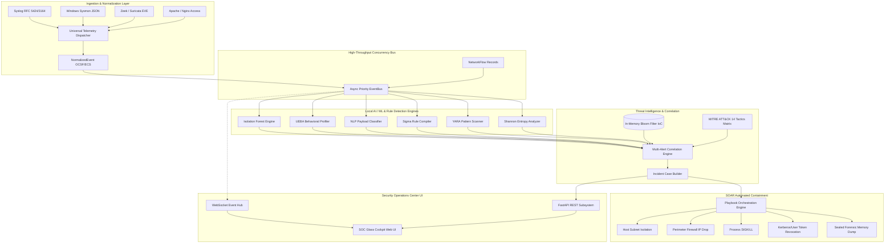

# CyberShield Enterprise Architecture & Technical Specification

## 1. Architectural Philosophy & Zero-External-Dependency Guarantee

CyberShield Enterprise is engineered as an on-premises, privacy-first cybersecurity platform capable of functioning within air-gapped data centers or sovereign cloud enclaves.

Unlike contemporary SaaS SIEM solutions that offload threat classification to external proprietary third-party APIs (such as OpenAI or vendor clouds), CyberShield Enterprise implements all machine learning, behavioral baselining, and heuristic classification **locally on the host machine**:
- **Isolation Forest Unsupervised Anomaly Detection**: Feature extraction and contamination isolation in pure scikit-learn/numpy.
- **Multinomial Naive Bayes + Character N-Gram Payload Inspector**: Pre-trained and locally updated for SQLi, XSS, RCE, SSRF, and Directory Traversal.
- **Shannon Entropy & PE/Binary Heuristic Scanner**: Computes randomness density across byte buffers to identify encrypted payloads and packer stubs.
- **Sigma YAML AST Evaluator**: Custom condition engine compiling Boolean selections (`and`, `or`, `not`, `1 of selection*`) against normalized telemetry streams.
- **YARA Pattern Matching Engine**: Evaluates text, hex byte sequences, and regular expressions against streaming events and memory buffers.
- **Cryptographic Evidence Ledger**: Tamper-evident SHA-256 chain of custody with HMAC authentication stamps.

---

## 2. High-Level System Topology

---

## 3. Subsystem Breakdown

### 3.1 Event Bus (`cybershield.core.bus`)
- Implements an asynchronous priority queue (`asyncio.PriorityQueue`) with monotonic integer tiebreakers to guarantee stable FIFO order among events of identical priority and millisecond timestamps.
- Priority levels:
  - `Priority 1`: Active Incident Creation & Critical Host Quarantines.
  - `Priority 2`: High-fidelity Critical Alerts (Ransomware, Mimikatz).
  - `Priority 5`: Standard Alerts & SOAR state changes.
  - `Priority 20`: Raw telemetry logs.
- Includes a Dead-Letter Queue (DLQ) retaining failed or saturated messages for auditing.

### 3.2 Detection Engines (`cybershield.engines.*`)
1. **Network Flow Anomaly (`anomaly.py`)**:
   - Computes logarithmic byte and packet rates: $\log(1 + \text{rate})$.
   - Evaluates port variance and TCP flags (SYN-only, Xmas scans, Null scans).
   - Combines Isolation Forest decision function with historical feature standard deviation Z-scores:
     $$\text{Composite Score} = \text{Score}_{\text{ML}} + \max(0, (Z_{\max} - 3.5) \times 12)$$
2. **UEBA Profiling (`ueba.py`)**:
   - Uses the Great-Circle Haversine formula to compute physical travel velocity ($km/h$) between consecutive authentication events from different geographical coordinates.
   - Triggers impossible travel alerts when calculated velocity exceeds 800 km/h.
3. **Payload Inspection (`payload.py`)**:
   - Character N-grams ($n \in [2, 5]$) vectorizer paired with a Multinomial Naive Bayes classifier trained on thousands of known SQLi, XSS, and RCE artifacts.
   - Combines with deterministic regex heuristic scoring for complete explainability.
4. **Static Binary Scanner (`static_scanner.py`)**:
   - Shannon Entropy Calculation:
     $$H(X) = -\sum_{i=1}^{n} P(x_i) \log_2 P(x_i)$$
   - Values $\ge 7.2$ trigger packer or encryption alerts.

### 3.3 CS-QL Query Engine (`cybershield.ingestion.query_engine`)
- Custom lexer and pipe-evaluator supporting relational filtering (`==`, `!=`, `>`, `<`, `contains`, `=~`), conjunctions (`and`, `or`), and pipeline transforms (`| stats count by <field>`, `| sort by <field> desc`, `| limit <N>`).
- Performs in-memory searches over circular ring buffers with zero external database dependencies.

### 3.4 Forensic Evidence Locker (`cybershield.incidents.evidence`)
- Seals digital forensic artifacts using SHA-256 hashes.
- Maintains cryptographic chain of custody where each step signs the preceding stamp:
  $$\text{Signature}_{i} = \text{HMAC-SHA256}_{K}(\text{ArtifactID} \parallel \text{Hash} \parallel \text{Analyst} \parallel \text{Action} \parallel \text{Timestamp} \parallel \text{Signature}_{i-1})$$
